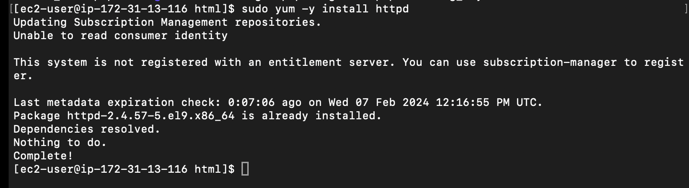

# Devops Tooling Website solution

### Implementing a business website using NFS for tge backend file storage

I implemented a WordPress-based solution that is now ready to be used as a fully functional website or blog.

I will be adding more value to this solution by implementing a tooling website solution that makes access to DevOps tools within the corporate infrastructure easily accessible.

I will introduce a set of DevOps tools that will help a team in day to day activities in managing, developing, testing, deploying and monitoring different projects. These tools are well known and widely used by multiple DevOps teams, so i will introduce a single DevOps Tooling Solution that will consist of:

- Jenkins

- Kubernetes

- Jfrog Artifactory

- Rancher

- Grafana

- Prometheus

- Kibana

In this project i will implement a solution that consists of following components:

Infrastructure: AWS

Webserver Linux: Red Hat Enterprise Linux 8

Database Server: Ubuntu 20.04 + MySQL

Storage Server: Red Hat Enterprise Linux 8 + NFS Server

Programming Language: PHP

Code Repository. Github

Architecture

We will be implementing a solution that comprises multiple web servers sharing a common database and also accessing the same files using Network File System (NFS) as shared file storage.

## Implementing a business website using NFS for the backend file storage.

Creating a business website that uses Network File System (NFS) for backend file storage is a viable option, especially if you need to share and manage files across multiple servers. Here are the steps to implement such a set up:

step 1 - Prepare NFS server

- Launch an EC2 instance with RHEL(Red Hat) Linux 9 operating system that will serve as an "NFS-Server".

- This instance should have three volumes same as your EC2 instance, each of 10 GB and attach each to the instance.
  

- Based on the steps documented in my previous project web-solution-with-wordpress, we Configured the App and DB Servers, also configured LVM on the server but in this case:

- Instead of formatting the disks as `ext4`, we will be formatting them as xfs.

- Ensure there are 3 Logical Volumes. `lv-opt` `lv-apps`, and `lv-logs`

- Create mount points on /mnt directory for the logical volumes as follows:

Mount `lv-apps` on `/mnt/apps` – To be used by web servers

Mount `lv-logs` on `/mnt/logs` – To be used by web server logs

Mount `lv-opt` on /`mnt/opt` – To be used by Jenkins server in a future project.

To list block devices and display disk space usage on your system

`$ sudo lsblk`

`$ sudo df -h`

Create Partitions by running the below commands and follow the prompts as documented previously to partition all three block storages.

`sudo gdisk /dev/xvdf`

`sudo gdisk /dev/xvdg`

`sudo gdisk /dev/xvdh`

Install lvm2 package

sudo yum install lvm2 -y

Run the below commands to create the physical volumes:

`sudo pvcreate /dev/xvdf`

`sudo pvcreate /dev/xvdg`

`sudo pvcreate /dev/xvdh`

Create a volume group called "nfsdata-vg".

`sudo vgcreate nfsdata-vg /dev/xvdf1 /dev/xvdg1 /dev/xvdh1`

Note: If you made a mistake with the disk specification and you wish to delete any of the disks from the volume group at this point, go to the aws ec2 console and detach the disks from the instances, create new disks with your desired specifications, and attach the new disks to the instance.

Use `lvcreate` utility to create 3 logical volumes of equal sizes. Means create a logical volume (LV) named "lv-apps", "lv-logs", "lv-opt" with a size of 9 gigabytes in the "nfsdata-vg" volume group.

`sudo lvcreate -n lv-apps -L 9G nfsdata-vg`

`sudo lvcreate -n lv-logs -L 9G nfsdata-vg`

`sudo lvcreate -n lv-opt -L 9G nfsdata-vg`

Run `sudo vgs` and `sudo lsblk` to see the available volume group size.

Use `mkfs.xfs` to format the logical volumes with `xfs `filesystem

`sudo mkfs -t xfs /dev/nfsdata-vg/lv-apps`

`sudo mkfs -t xfs /dev/nfsdata-vg/lv-logs`

`sudo mkfs -t xfs /dev/nfsdata-vg/lv-opt`

create Mount point on `/mnt `directory for the logical volumes.

- mount lv-apps on /mnt/apps

- mount lv-logs on /mnt/logs

- mount lv-opt on /mnt/opt

Create a /mnt directory.

`sudo mkdir -p /mnt/apps`

`sudo mkdir -p /mnt/logs`

`sudo mkdir -p /mnt/opt`

Mount directories.

`sudo mount /dev/nfsdata-vg/lv-apps /mnt/apps`

`sudo mount /dev/nfsdata-vg/lv-logs /mnt/logs`

`sudo mount /dev/nfsdata-vg/lv-opt /mnt/opt`

Once mount is completed run `sudo blkid` to get the UUID of the mount part.

open and paste the UUID in the `sudo vi /etc/fstab `file.

`sudo mount -a`

`sudo systemctl daemon-reload`

`sudo df -h`

step 2: Install the NFS server, configure it to start on reboot, and make sure it is up and running.

`sudo yum update -y`

sudo yum install nfs-utils -y

`sudo systemctl start nfs-server.service`

`sudo systemctl enable nfs-server.service`

`sudo systemctl status nfs-server.service`

We set up permission that will allow our Web servers to access files on NFS.

Change ownership

`$ sudo chown -R nobody: /mnt/apps`

`$ sudo chown -R nobody: /mnt/logs`

`$ sudo chown -R nobody: /mnt/opt`

Change permission

`$ sudo chmod -R 777 /mnt/apps`

`$ sudo chmod -R 777 /mnt/logs`

`$ sudo chmod -R 777 /mnt/opt`

Restart the NFS server

`sudo systemctl restart nfs-server`

step 3: Export the mounts for webservers `subnet cidr` to connect as clients. In this project, we will keep things simple by installing all three webservers inside the same subnet, but in production, these will probably be kept in different subnets for a higher level of security.

To check the `subnet cidr`, open the properties of your EC2 instance on the AWS console and click on the "Network" tab, open the "Subnet ID" link in a new tab, and locate "IPv4 CIDR"

Subnet CIDR: (Classless Inter-Domain Routing) notation is used to define and represent a range of IP addresses within a network. It consists of an IP address and a prefix length, separated by a slash ("/"). The prefix length indicates how many bits in the address are used for network identification, allowing you to specify a range of IP addresses within a subnet.

## Configure the backend database as part of 3 tier architecture

Step 2- configure the database 

By now you show how to install and configure a mysql dbms to work with a remote web server 

1. Install Mysql server
2. Create a databse and name it `tooling`
3. Create a database user and name it `webaccess`
4. Grant permission to `webaccess` user on `toooling` database to do anything only from the webservers `subnet cidr`

Configure access to NFS for clients within the same subnet

`$ sudo vi /etc/exports`

`$ sudo exportfs -arv`

Check which port is used by NFS and open it in the Security Group.

`rpcinfo -p | grep nfs`

Step 3- prepare the webservers

We need to make sure that our webservers can serve the same
content from shared storage solutions – NFS Server and MySQL database. We already know that one DB can be accessed for reads and writes by multiple clients. For storing shared files that our Web Servers will use – we will utilize NFS and mount previously created Logical Volume lv-apps to the directory where Apache stores files to be served to the users i,e /var/www.

This approach will make our Web Servers stateless, which means we will be able to add new ones or remove them whenever we need, and the integrity of the data (in the database and on NFS) will be preserved.

To achieve this, we need take do the following steps:

- Configure NFS client (this step must be done on all three servers).

- Deploy a Tooling application to our Web Servers into a shared NFS folder.

- Configure the Web Servers to work with a single MySQL database.

We will be using three webservers to demonstrate this.

Install Mysql client to be able to access the database

`$ sudo yum install mysql

Create directory

`$ sudo mkdir /var/www`

`$ sudo mount -t nfs -o rw,nosuid <NFS-Server-Private-IP-Address>:/mnt/apps /var/www`

Verify that NFS was mounted successfully by running

$ df -h.

To make sure that the changes will persist on Web Server after reboot, we add it to the /etc/fstab file.

`$ sudo vi /etc/fstab`

then add the following

`<NFS-Server-Private-IP-Address>:/mnt/apps /var/www nfs defaults 0 0`

Install Remi’s repository, Apache and PHP

`$ sudo yum install httpd -y`

`$ sudo dnf install https://dl.fedoraproject.org/pub/epel/epel-release-latest-8.noarch.rpm`

`$ sudo dnf install dnf-utils http://rpms.remirepo.net/enterprise/remi-release-8.rpm`

`$ sudo dnf module reset php`

`$ sudo dnf module enable php:remi-7.4`

`$ sudo dnf install php php-opcache php-gd php-curl php-mysqlnd`

Verify that Apache files and directories are available on the Web Server in /var/www and also on the NFS server in /mnt/apps. If you see the same files, it means NFS is mounted correctly.
You can test this by creating a new file touch test.txt from one web server and check if it is accessible from other web servers.

Inside the tooling-repo directory, we copy the content of the repository into the directory by running the command:

`$ git clone <github-url>`

"github-url" is the url we copied from github.

Deploy the html directory to the /var/www/html directory.

`$ sudo cp -R tooling-repo/tooling/html /var/www/html`

Restart the Apache

`$ sudo systemctl restart httpd`

Open port 80 on webservers to be able to connect to the browser.

Open port 3306 on both database server and web servers.

set selinux policy:

`$ sudo setenforce 0`

To make this change permanent – open following config file

`$ sudo vi /etc/sysconfig/selinux`

Set `SELINUX=disabled`

then restart httpd.

`$ sudo systemctl restart httpd`

Update the website’s configuration to connect to the database in /var/www/html/functions.php.

`$ sudo vi /var/www/html/functions.php`

We create a new admin by applying tooling-db.sql script from (tooling-repo directory) to your database using the command:

$ mysql -h <databse-private-ip> -u <db-username> -p <database> < tooling-db.sql

To check for the created admin in the database we run the commands

`$ sudo mysql -p`

`mysql> use tooling;`

`mysql> show tables;
`
`mysql> select from * users;`

Open the website in your browser

http://<Web-Server-Public-IP-Address-or-Public-DNS-Name>/index.php

We should be able to loging using our username amd password as both admin. If we are unable to log in, we should check our connection to the database.

