# Linux Project

## Prerequisites
- Introduction to Linux and Basic Commands
- File Manipulation
- File permission and Ownership

## File Manipulation

1. **sudo command**
- `sudo apt upgrade`

2. **pwd command**
- `pwd`
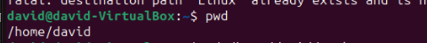

3. **cd command**
- `cd`
4. **ls command**
- `ls`

- `ls -a`
- `ls -lh`

5. **cat command**
- `cat file3.txt file4.txt`
- `tac file3.txt file4.txt`

6. **cp command**
- `cp file3.txt file4.txt`
- `cp -r /home/david/Devops_folder /home/david/Devops`
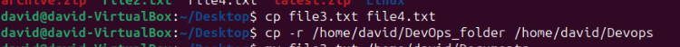

7. **mv command**
- `mv`

8. **mkdir command**
9. **rmdir command**
10. **rm command**
- `mkdir hymns`
- `mkdir hymns/symphony`
- `rmdir -p hymns/symphony`
- `rm file5.txt` 

11. **touch command**
- `touch file6.txt`

12. **locate command**
- `locate -i lines`
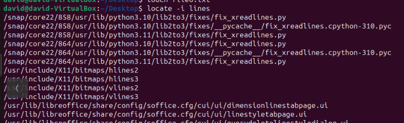

13. **find command**
`find file3.txt`

14. **grep command**

15. **df command**
- `df -h`
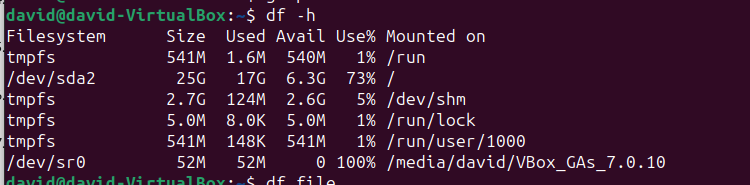

16. **du command**
- `du /home/david/Devops`
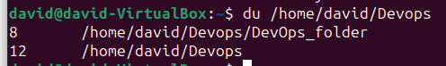

17. **head command**
18. **tail command**
- `head file2.txt`
- `tail file2.txt`

19. **diff command**
- `diff file2.txt file3.txt`
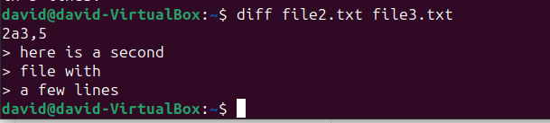

20. **tar command**
- `tar -cvf ubuntu,tar /home/david`
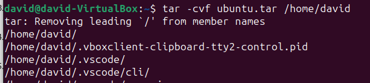

## File Permissions and OWnership

21. **chmod command**
- `chmod 777 file2.txt`

22. **chown command**
- `chown david file2.txt`

23. **jobs**
- `jobs`

24. **kill command**
- `kill SIGKILL 14223`
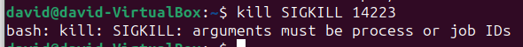

25. **ping**
- `ping darey.io`
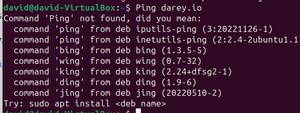

26. **wget command**
-`wget https://wordpress.org/latest.zip`
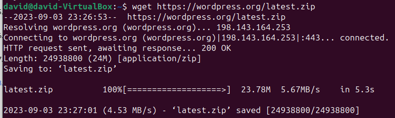

27. **uname command**
- `uname`

28. **top command**
- `top`
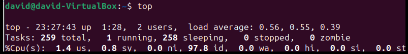

29. **history**
- `histoy`
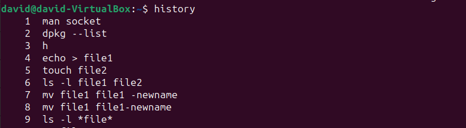

30. **man**
31. **echo**
- `man man`
- `echo`

32. **zip and unzip commands**
- `zip archive.zip linu.txt`
- `unzip archive.zip file2.txt`
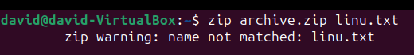
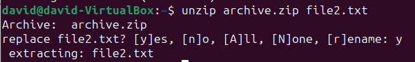

33. **hostname command**
- `hostname -i`

34. **useradd, userdel commands**
- `useradd tobi`
- `userdel tobi`
- `passwd 123344`

35. **apt-get command** 
- `apt-get`
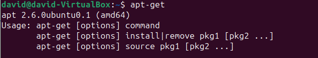

36. **nano vi jed commands**
- `nano`

37. **alias and unalias**
- `alias k=keep`
- `unalias k=keep`

38. **su command**
- `su`
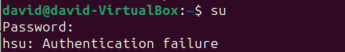

39. **htop command**
- `htop`

40. **ps command**
- `ps`
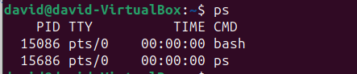