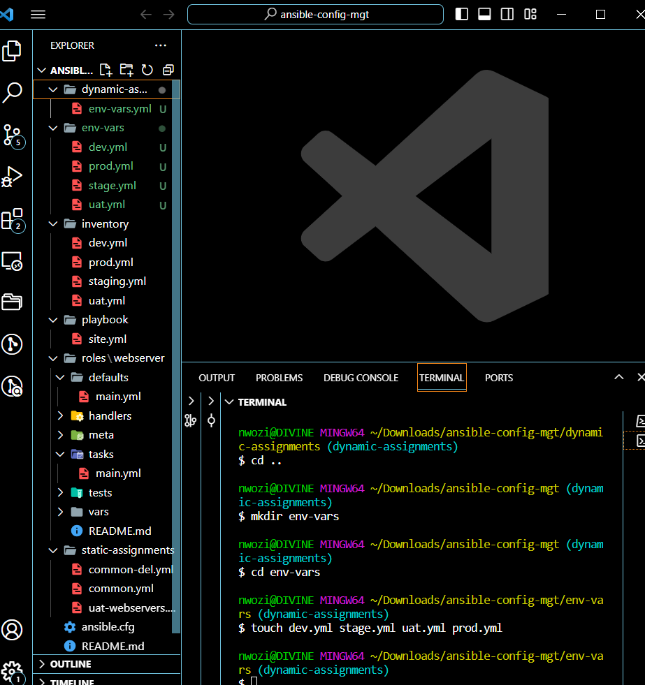
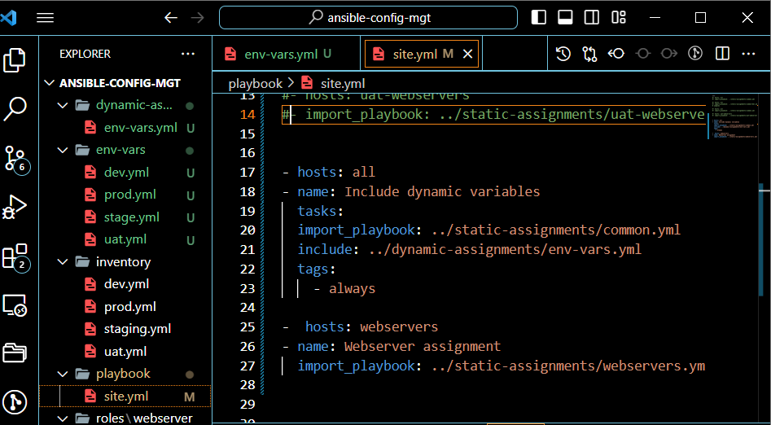
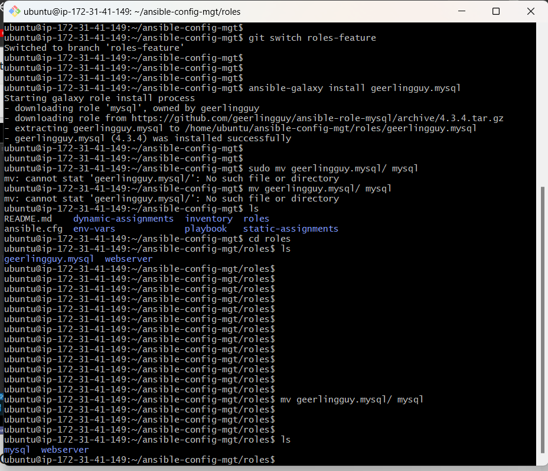
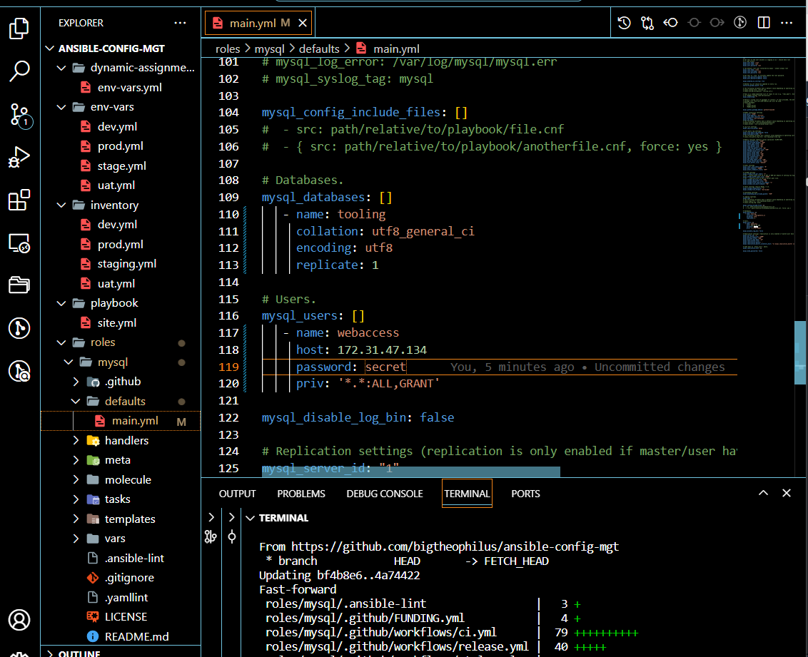
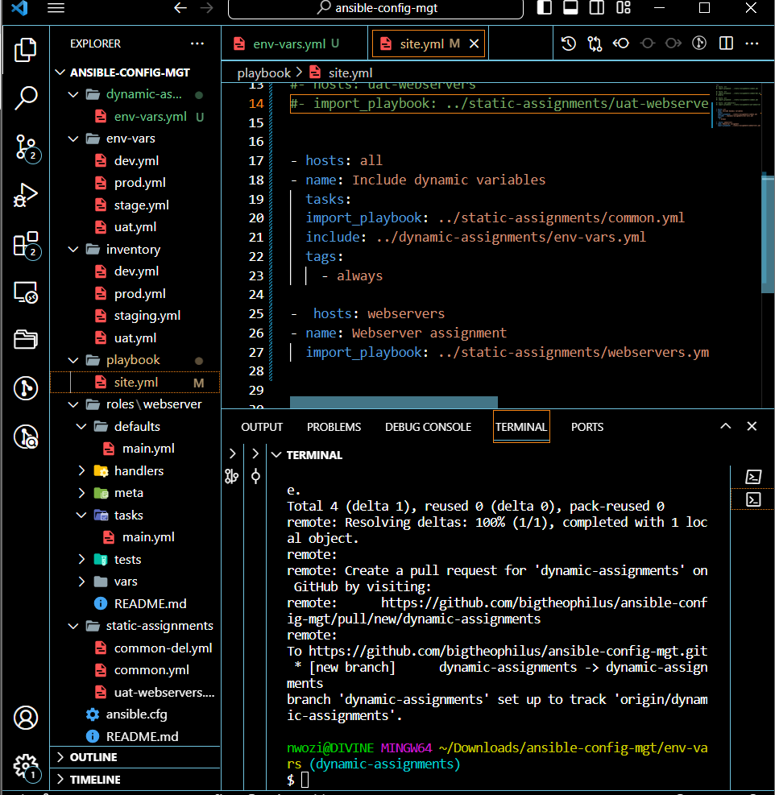
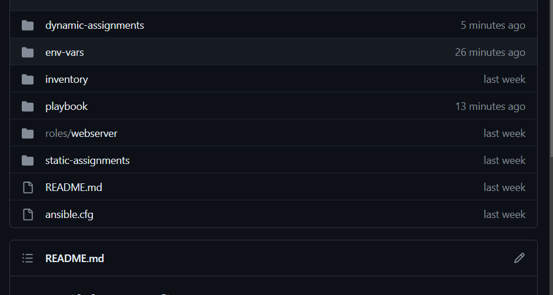
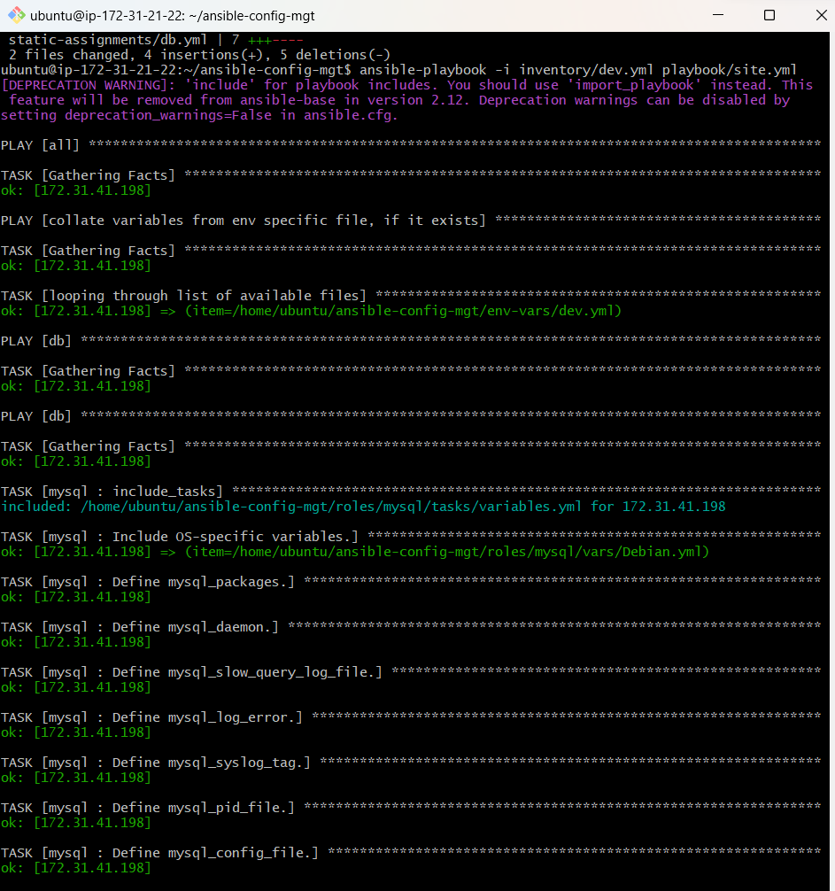
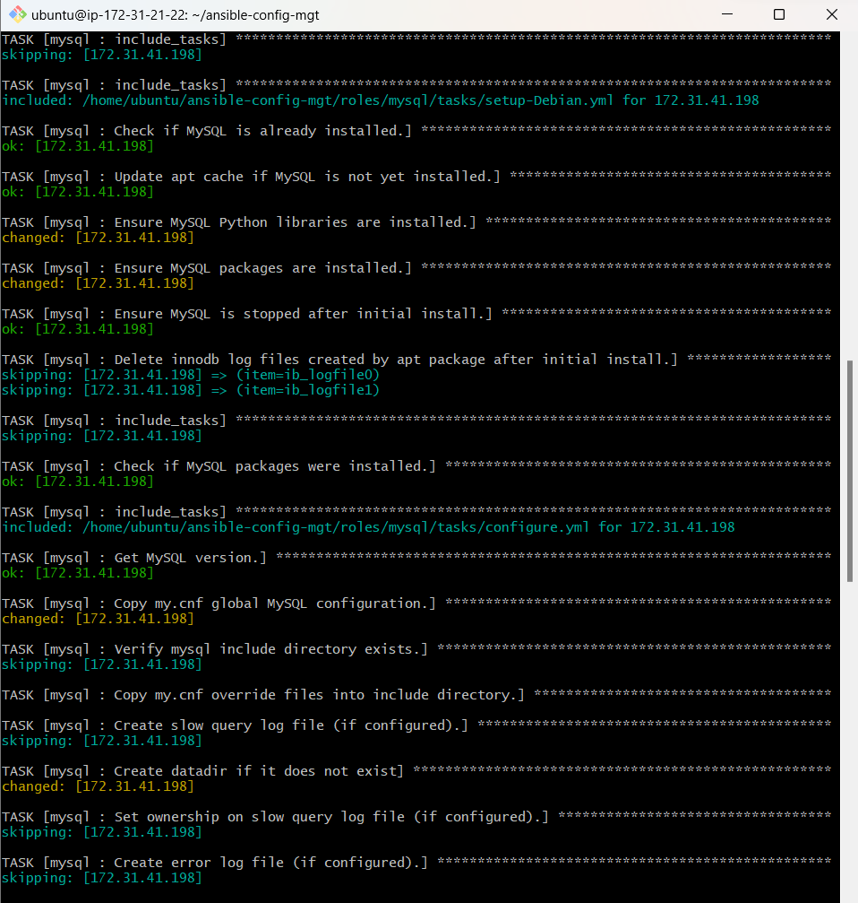
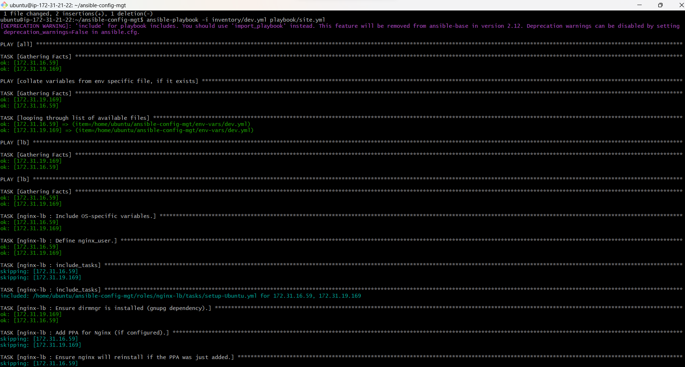
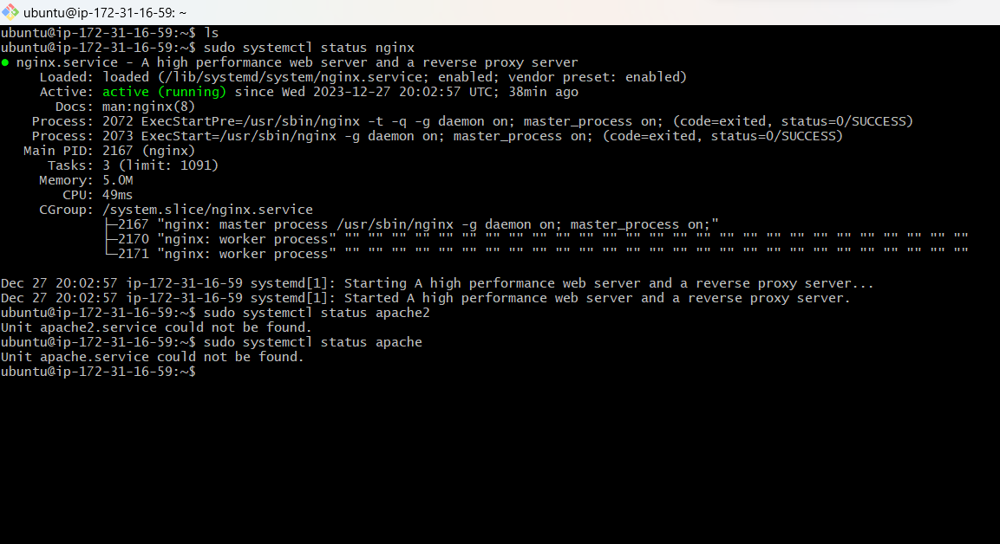

## ANSIBLE DYNAMIC ASSIGNMENT

This project is aimed at achieving configuration with the include module, its a continuation of project 11 and 12. In project 12 we explored static assignment where we used the export module to ahieve the configuration but in this dynamic assignment include module is used which is the major difference between static and dynamic assignments.

`import =static assignment
`
`include =dynamic asignment`

in export (static assignments) when executing site.yml,playbook, ansible will process all the playbooks refereced during the time it is parsing the statements. what this means is that during the actual execution, if any statement changes, such statements will not be considered, hence its static

while include (dynamic assignments) all statemets are processed only during execution of thr playbook. that is any changes tothe statements encountered during execution will be used.

**NOTE:**

Static assigments are more reliable and stable than dynamic assignments hence they are most recommended. however dynamic assignments can be used for enviroment specific variables.

### Step one: I created a dynamic assignment branch and new folder called dynamic assignment and a file called env-vars.yml

updaye site.yml

used the Ansible galaxy community to install the roles necessary, mysql etc after editing the roles changes where committied to github acct and branch merged to the main and pull to the production server or enviroment and the playbook was ran inventory/dev.yml aganst playbook/site.yml

.png>)

### Setting nginx and apache loadbalancers

On defaults/main new configuration setting made and on static assignments folrders created file for apache and nginx and then ran the play book to install and configure nginx as a load balancer and repeat the same for apache

