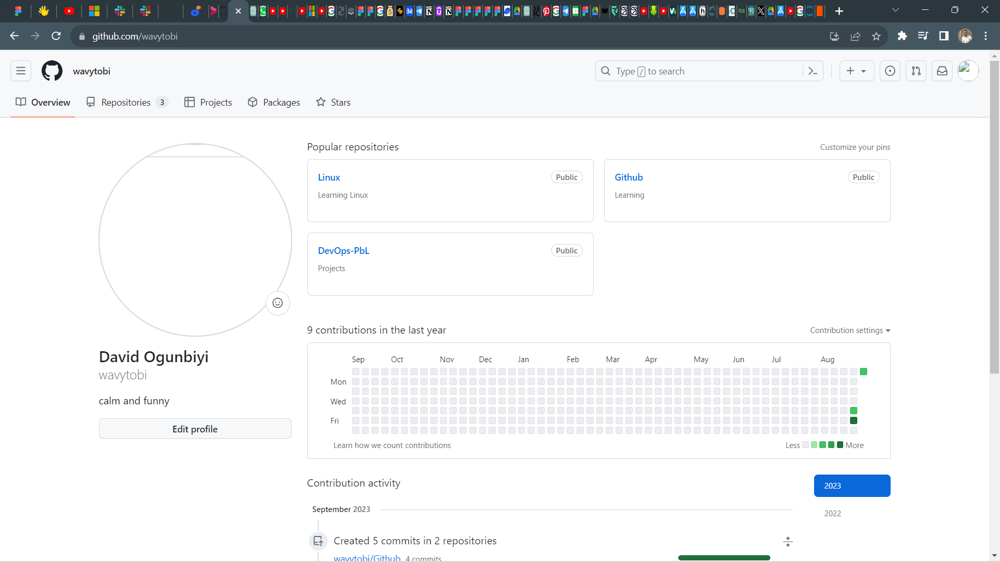

# Git project

## Prerequisite
- Initializing a Repository and Making commit
- Working with branches
- Collaboration and Remote Repositories
- Branch Management and Tagging

## Initializing a Repository and Making commit 

- Opened my terminal **Git bash** and ran 3 commands.

- I used the command `mkdir DevOps` to make a working folder

- I used `cd DevOps` to enter the folder

- Inside my working directory created a working file using
`touch Mega.txt`

- Wrote some lines inside the txt file using
`echo "Exicted to be making my first commit" > Mega.txt`

- Added changes to git using the command
`git add .`

- To commit my changes to git, I ran the command.
git commit -m `"first commit"`

## Making my first git branch

- I made a new branch using command
`git checkout -b my-new-branch`

- Listed my git branches using command
`git branches`

- changed into an old branch
`git checkout master`

- Tried to merge 2 branches into 1 using
`git merge master`

- Deleted a branch using 
`git branch -d tmp`

## Collaborations and Remote repositories

Downloaded and verified my account

Created my first repository

## Pushing local git repo to Remote github repository 

# Branch Management and Tagging

### Headings

# Heading 1
## Heading 2
### Heading 3

### Emphasis 

*italics* or _italics_
**Bold** or __bold__

### Lists

- Item 1
- Item 2
- Item 3

### Ordered list 

1. First item 
2. Second item
3. Third item 

### Links 

### Code 

`sudo apt`

