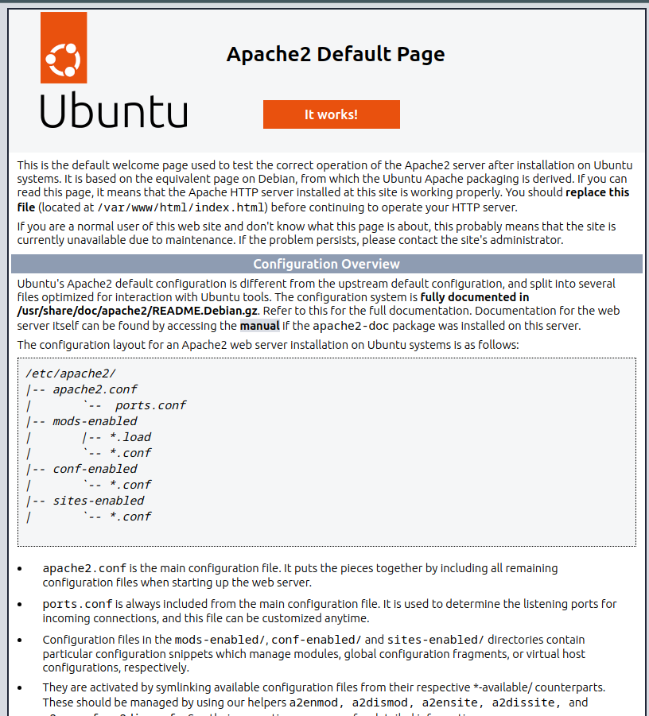
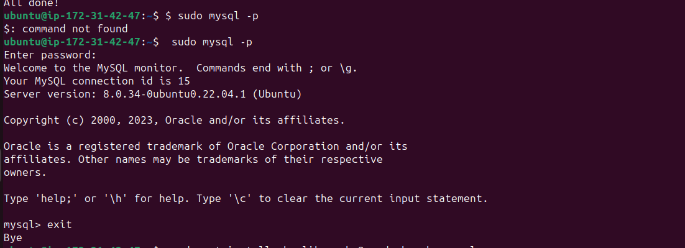
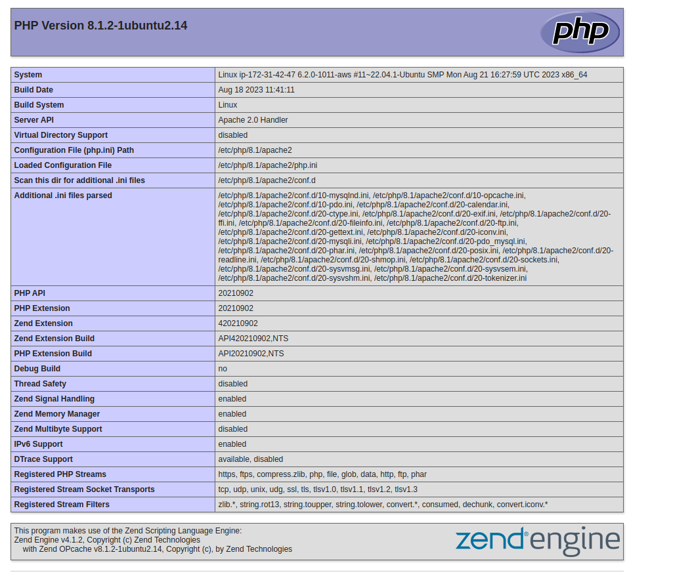

# LAMP STACK IMPLEMENTATION (Linux Apache MySQL PHP)

## Prerequisite
- Cloud Service Provider- AWS,Azure,GCP,etc.
- Launch a Linux Instance (Ubuntu).
- Priot Knowledge on how to SSH into a virtual host.

## STEP1-INSTALLING APACHE WEB SERVER

Install Apache using Ubuntu's package manager
`apt`

Update a list of packages in a package manager
`sudo apt update`

Run Apache2 package installation
`sudo apt install apache2`

To verify that Apache2 is running as a service in my OS, use following command 
`sudo systemctl status apache2`

To view the Apache default page, Go to [https://34.207.133.112:80] in your browser

## STEP2-INSTALLING MYSQL

Again, use `apt` to acquire and install this software:
`sudo apt install mysql-server`

When prompted, confirm instaallation by typing Y, and then ENTER.

When the installation is finished, log in to the MySQL console by typing:
`sudo mysql`

This will connect to the MySQL server as the administrative database user root, which is inferred by the use of sudo when running this command.
 `ALTER USER 'root'@'localhost' IDENTIFIED WITH mysql_native_password BY 'PassWord.1';`

 Exit the MYSQL shell with:
 `mysql> exit`

 Start the interactive script by running:
 `sudo mysql_secure_installation`

 This will ask if you want to configure the VALIDATE PASSWORD PLUGIN.

 

## STEP3-INSTALLING PHP

**PHP** is the component of our setupthat will process code to displaydynamic content to the end user.In addition to the `php` package,
you'll need `php-mysql`, a PHP module that allows PHP to communicate with MySQL-based databases. You'll also need `libapahe2-mod-php` to enable Apache to handle PHP files. Core PHP packages wil automatically be installed as dependencies.

To install these 3 packages at once, run:
`sudo apt install php libapache2-mod-php php-mysql`

## STEP4-CREATING A VIRTUAL HOST FOR YOUR WEBSITE USING APACHE

Create the directory for the 'newproject' using `mkdir` commands as follows:
`sudo mkdir /var/www/newproject`

Next, assign ownership of the directory with your current system user:
`sudo chown -R $USER:USER /var/www/newproject`

Create and open a new configuration file in Apache's site-available directory using:
`sudo nano /etc/apache2/sites-available/newproject.conf`

Paste in the following bare-bones configuration
`<VirtualHost *:80>
ServerName newproject
ServerAlias www.newproject
ServerAdmin webmaster@localhost
DocumentRoot /var/www/newproject
ErrorLog ${APACHE_LOG_DIR}/error.log
CustomLog ${APACHE_LOG_DIR}/access.log combined
</VirtualHost>`

Use `a2ensite` command to enable the new virtual host:
`sudo a2sensite newproject`

To disable Apache's default website use `a2dissite`command, type:
`sudo a2dissite 000-default`

To make sure the file doesn't contain syntax errors, run:
`sudo apache configtest`

Reload Apache so thes changes can take effect:
`sudo systemctl reload apache2`

## STEP5-ENABLE PHP ON THE WEBSITE

With the default **Directory Index** settings on Apache, a file named `index.html` will always take precedence overan `index.php` file.

To change this behaviour,you will need to edit the **/etc/apache2/mods-enabled/dir.conf** file and change the order in which the **index.php** file is listed within the **Directoryindex** directive:

`sudo vim /etc/apache2/mods-enabled/dir.conf`

After saving and closing the file, you will need to reload Apache do 
the changes take effect:

`sudo systemctl reload apache2`

### Create a PHP script to test that PHP is correctly installed and configured on my server.

create a new file `index.php` inside the custom web root folder

`vim /var/www/projectLAMP/index.php`

This will open a blank file.Add the following text, which is valid PHP code, inside the file.
`<?php
phpinfo();`

When you are finished, save and close the file, refresh the page and you will see a page similar to this:

