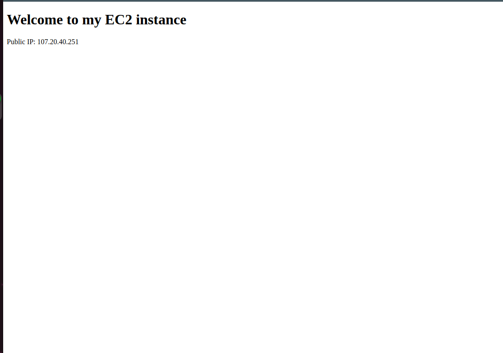

# Automating Loadbalancer configuration with Shell scripting

## Prerequisties
-  Automate the Deployment of Webservers
- Deploying and Configuring the webserver

### Automate the Deployment of Webservers

Automation is in the heart of what DevOps engineer do, Automation helps us speed the deployment of services and reduce the chance of making errors in our day to day activity.

### Deploying and Configuring the Webservers

The process is as folllows,

**Step 1**: Provision an Ec2 instance running on ubuntu

**Step 2**: Open port 8000 to allow traffic from anywhere using the security group.

**Step 3**: Connect to the webserver via terminal using SSH Client.

**Step 4**: Open a file, and paste Script below and close the file using the command below:
`sudo vi install.sh`

**Step 5**: I changed the permission on the file to make it excutable using the command below:
`sudo chmod +x install.sh`

**Step 6**: Ran the shell script using the command below, after i made sure i read the instructions in the script to learn how to use it.
`./install.sh 107.20.40.251`

### Deploying and Configuring Nginx Load Balancer

Steps to Run the shell script

**Step 1**: On your terminal, Open a file nginx using the command below:
` sudo vi nginx.sh`

**Step 2**: Copy and paste the script inside the file

**Step 3**: Close the file using `esc shift + :wqa!`

**Step 4**: I changed the file permission to make it  executable using the command below:
`sudo chmod +x nginx.sh`

**Step 5**:Run the script with the command below:
./nginx.sh 34.228.77.37 107.20.40.251:8000 54.226.36.233:8000

**Webserver 1**

**Webserver 2**

**Load Balancer**

