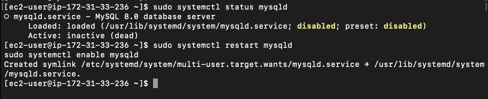
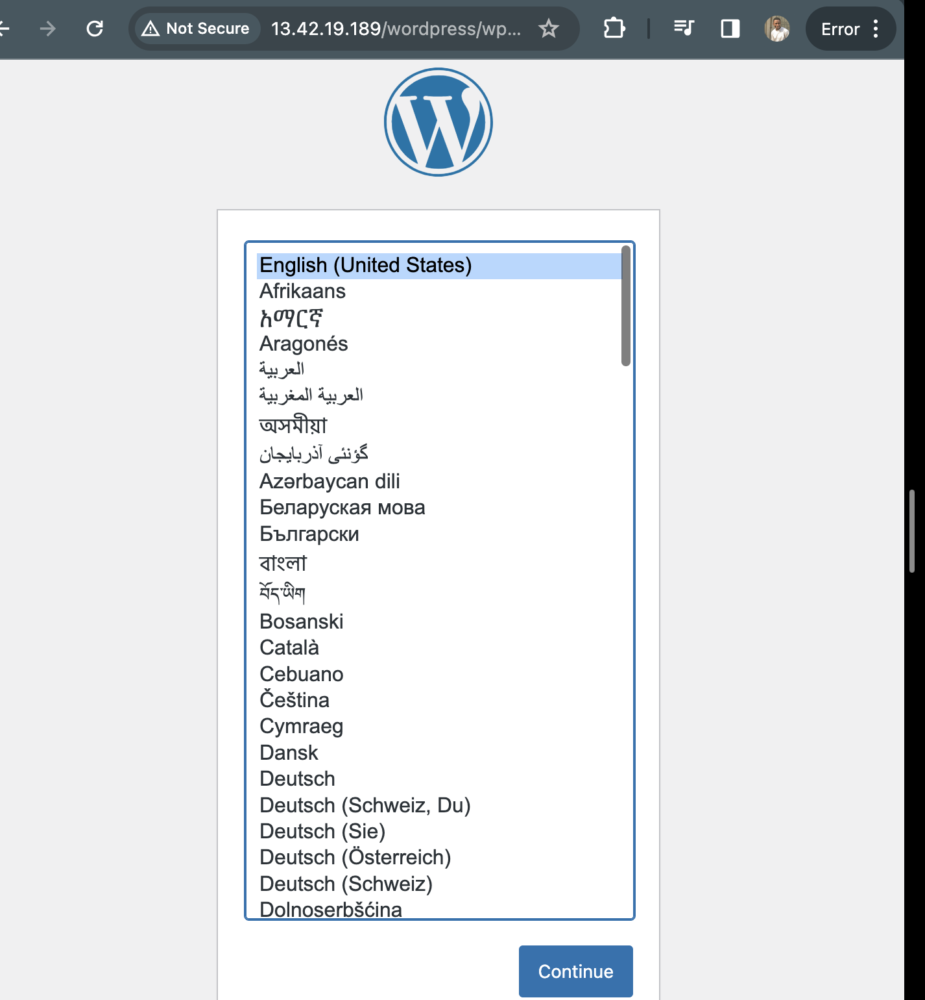
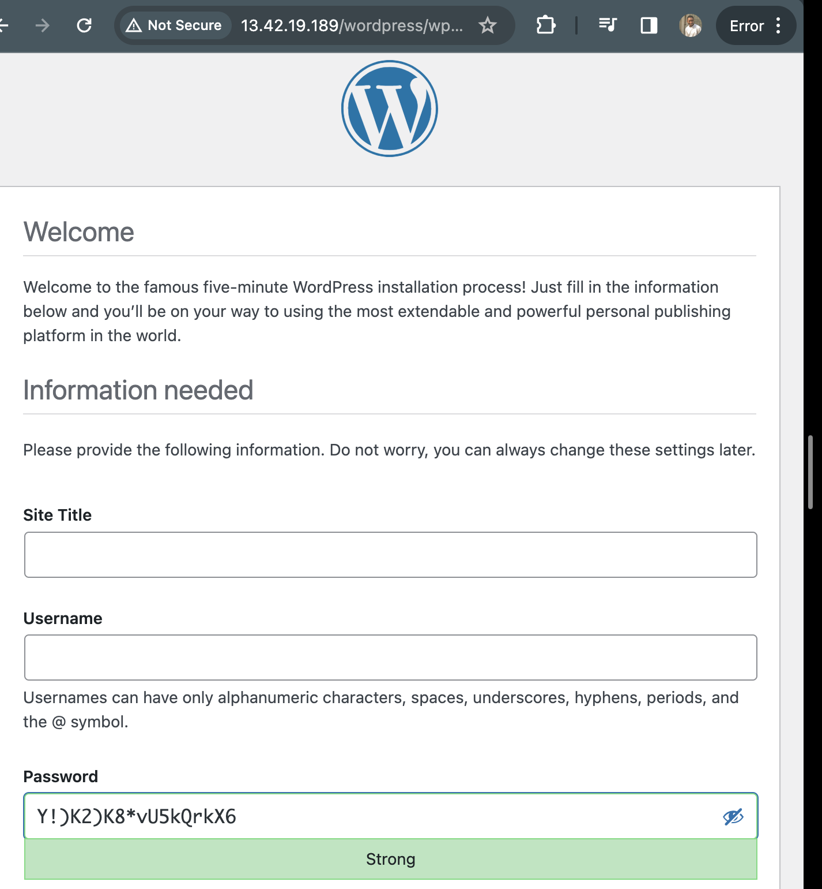
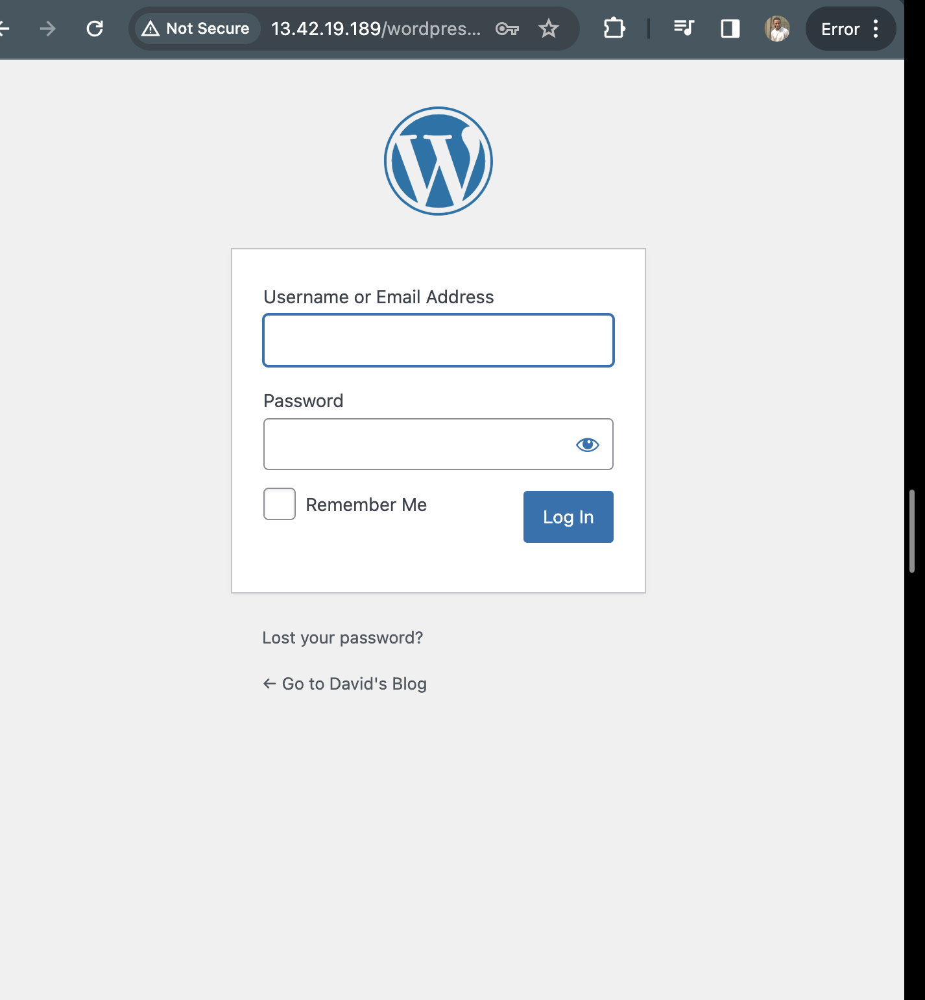
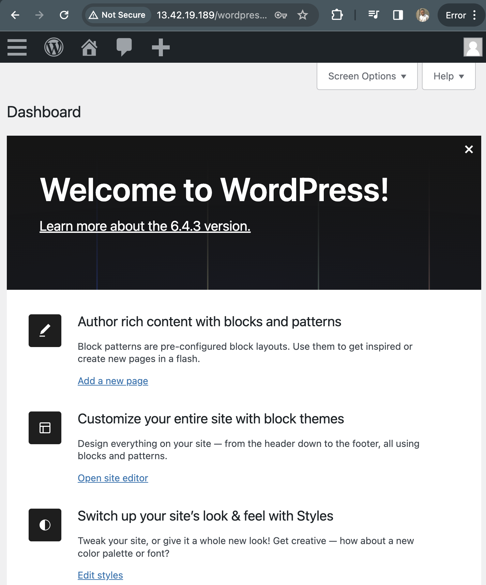

# Implementing Wordpress website with LVM Storage management

## WEB SOLUTION WITH WORDPRESS 

In this project we will be tasked to prepare storage infrastructure on two Linux servers and implement a basic web solution using WordPress.

WordPress is a free and open-source content management system written in PHP and paired with MySQL or MariaDB as its backend Relational Database Management System (RDBMS).

Project 6 consists of two parts:

- Configure storage subsystem for Web and Database servers based on Linux OS. The focus of this part is to give you practical experience of working with disks, partitions and volumes in Linux.

- Install WordPress and connect it to a remote MySQL database server. This part of the project will solidify your skills of deploying Web and DB tiers of Web solution.

Three-tier Architecture

Generally, web, or mobile solutions are implemented based on what is called the Three-tier Architecture.

Three-tier Architecture is a client-server software architecture pattern that comprise of 3 separate layers.

- Presentation Layer (PL): This is the user interface such as the client server or browser on your laptop.

- Business Layer (BL): This is the backend program that implements business logic. Application or Webserver.

- Data Access or Management Layer (DAL): This is the layer for computer data storage and data access. Database Server or File System Server such as FTP server, or NFS Server.

In this project, we will showcase Three-tier Architecture while also ensuring that the disks used to store files on the Linux servers are adequately partitioned and managed through programs such as gdisk and LVM respectively.

Our 3-Tier Setup

A Laptop or PC to serve as a client.
An EC2 Linux Server as a web server (This is where you will install WordPress).
An EC2 Linux server as a database (DB) server.
We will use RedHat OS(centos) for this project.

LAUNCH AN EC2 INSTANCE THAT WILL SERVE AS “WEB SERVER”.

After logging into our Aws console, we go to EC2 and click on "volume" under Elastic block store(EBS).

Learn How to Add EBS Volume to an EC2 instance here

Click on "create volume"

then change size to 10GiB and click on create volume afterwards.

We do the same process to create three EBS volumes.

Open the linux terminal, connect to the instance.

3. Connect to your linux server and check what block devices are attached using this command: `$ lsblk`

Take notes of the names of your newly created devices. All devices in linux resides in /dev/directory. Inspect it with $ `ls /dev/` and make sure you see all 3 newly created block devices there - their names will likely be xvdf , xvdg , xvdh .

4. Use `$ df -h` command to see all mounts and free space on your server.

5. Use gdisk utility to create a single partition on each of the 3 disks.
   
"gdisk" is used to create or manage GPT. (GUID partition table).

"/dev/xvdf, /dev/xvdg, /dev/xvdh" this is the path to the specific device you want to manage with gdisk.

`$ sudo gdisk /dev/xvdf`

Type `"?"` command for help to view the options.

Type `"n"` command to add a new partition.

Enter `"p"` command to print the new partition table.

Then use the `"w"` command and enter "y" to write table to disk.

Also repeat the same for the other two disks: `$ sudo gdisk /dev/xvdg` , s`udo gdisk /dev/xvdh` .

Result for disk 1:

5. Use `lsblk` utility to view the newly configured partition on each of the 3disks.

6. Install `lvm2` package using 

`$ sudo yum install lvm2`

Run

`$ sudo lvmdiskscan to check for available partitions.`

Use pvcreate utility to mark each of 3 disks as physical volumes (PVs) to be used by LVM.

`$ sudo pvcreate /dev/xvdf1`

`$ sudo pvcreate /dev/xvdg1`

`$ sudo pvcreate /dev/xvdh1`

s

Verify that your Physical volume has been created successfully by running

`$ sudo pvs`

Use vgcreate utility to add all 3 PVs to a volume group (VG). Name the VG webdata-vg

`$ sudo vgcreate webdata-vg /dev/xvdh1 /dev/xvdg1 /dev/xvdf1`

Verify that your VG has been created successfully by running

`$ sudo vgs`

Use lvcreate utility to create 2 logical volumes. apps-lv (Use half of the PV size), and logs-lv (Use the remaining space of the PV size).

The apps-lv will be used to store data for the Website while, logs-lv will be used to store data for logs.

`$ sudo lvcreate -n apps-lv -L 14G webdata-vg`

`$ sudo lvcreate -n logs-lv -L 14G webdata-vg`

Verify that your Logical Volume has been created successfully by running

`$ sudo lvs`

Verify the entire setup

`$ sudo vgdisplay -v #view complete setup - VG, PV, and LV`

`$ sudo lsblk
`

Use "mkfs.ext4" to format the logical volumes with "ext4" filesystem

`$ sudo mkfs -t ext4 /dev/webdata-vg/apps-lv`

`$ sudo mkfs -t ext4 /dev/webdata-vg/logs-lv`

Create "/var/www/html" directory to store website files

`$ sudo mkdir -p /var/www/html`

Create /home/recovery/logs to store backup of log data

`$ sudo mkdir -p /home/recovery/logs`

Mount "/var/www/html" on "apps-lv" logical volume

`$ sudo mount /dev/webdata-vg/apps-lv /var/www/html/`

Use rsync utility to backup all the files in the log directory "/var/log" into "/home/recovery/logs" (This is required before mounting the file system).

`$ sudo rsync -av /var/log/. /home/recovery/logs/`

Mount "/var/log" on "logs-lv" logical volume. (all the existing data on "/var/log" will be deleted.

`$ sudo mount /dev/webdata-vg/logs-lv /var/log
`
Restore log files back into "/var/log" directory.

`$ sudo rsync -av /home/recovery/logs/. /var/log`

Update "/etc/fstab file" so that the mount configuration will persist after restart of the server.

UPDATE THE "/ETC/FSTAB" FILE.

The UUID of the device will be used to update the /etc/fstab file;

`$ sudo blkid`

Open the "/etc/fstab"

`$ sudo vi /etc/fstab`

Update /etc/fstab in this format using your own UUID and remember to remove the leading and ending quotes.

Test the configuration by running this command. There will be no errors if everything is ok.

`$ sudo mount -a`

Reload the daemon

`$ sudo systemctl daemon-reload`

Verify your setup by running

`df -h`

## Install WordPress on your Web Server EC2

1. Update the repository

`$ sudo yum -y update`

2. Install wget, Apache and it’s dependencies

`$ sudo yum -y install wget httpd php php-mysqlnd php-fpm php-json`

3. Start Apache

`$ sudo systemctl start httpd`

Enable Apache

`$ sudo systemctl enable httpd`

Verify Apache status

`$ sudo systemctl status httpd`

4.To install PHP and it’s depemdencies

`sudo yum install https://dl.fedoraproject.org/pub/epel/epel-release-latest-8.noarch.rpm
sudo yum install yum-utils http://rpms.remirepo.net/enterprise/remi-release-8.rpm
sudo yum module list php
sudo yum module reset php
sudo yum module enable php:remi-7.4
sudo yum install php php-opcache php-gd php-curl php-mysqlnd
sudo systemctl start php-fpm
sudo systemctl enable php-fpm
sudo setsebool -P httpd_execmem 1`

1. Restart Apache

`sudo systemctl restart httpd`

6. Download wordpress and copy wordpress to var/www/html

`mkdir wordpress
cd   wordpress
sudo wget http://wordpress.org/latest.tar.gz
sudo tar xzvf latest.tar.gz
sudo rm -rf latest.tar.gz
cp wordpress/wp-config-sample.php wordpress/wp-config.php
cp -R wordpress /var/www/html/`

7. Configure SElinux Policies
` sudo chown -R apache:apache /var/www/html/wordpress
 sudo chcon -t httpd_sys_rw_content_t /var/www/html/wordpress -R
 sudo setsebool -P httpd_can_network_connect=1`

## Prepare the Database server

Lauched a Redhat Database server

Attached Volumes to it

ssh it to the terminal

### Install Mysql on your Database server

Update the repository

`$ sudo yum update -y`

Install mysql-server

`$ sudo yum install mysql-server`

Verify that the services is ip and runnning by using `sudo systemctl status mysqld`, if its not running, restart the service and enable it so it will be running even after reboot:

### Configure DB to work with worddpress

`sudo mysql
CREATE DATABASE wordpress;
CREATE USER `myuser`@`<Web-Server-Private-IP-Address>` IDENTIFIED BY 'mypass';
GRANT ALL ON wordpress.* TO 'myuser'@'<Web-Server-Private-IP-Address>';
FLUSH PRIVILEGES;
SHOW DATABASES;
exit`

Configure wordpress to connect to remote database.

Open MySQL port 3306 on DB Server EC2. For extra security, you shall allow access to the DB server ONLY from your Web Server’s IP address, so in the Inbound Rule configuration specify source as /20

Install MySQL client and test that you can connect from your Web Server to your DB server by using mysql-client.

`$ sudo yum install mysql`

Connecting webserver to DBserver and Verify if you can successfully execute SHOW DATABASES; command and see a list of existing databases.

`$ sudo mysql -u myuser -p -h <DB-Server-Private-IP-address>`

Change permissions on the "/var/www/html" directory so that apache can use wordpress.

Edit the "/var/www/html/wp-config.php" to connect to dataabase.

Enable TCP port 80 in Inbound Rules configuration for your Web Server EC2 (enable from everywhere 0.0.0.0/0 or from your workstation’s IP)

Try to access from your browser the link to your WordPress

`http://<Web-Server-Public-IP-Address>/wordpress/`

